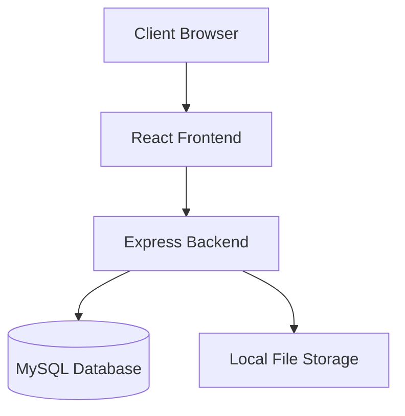
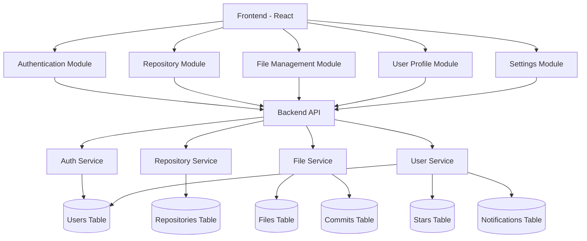
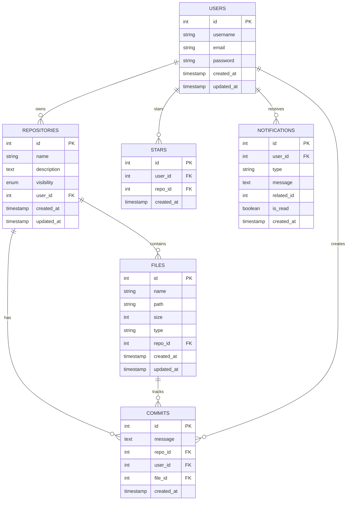

# DevDock Architecture

## High-Level Architecture

```mermaid
graph TB
    A[Client Browser] --> B[React Frontend]
    B --> C[Express Backend]
    C --> D[(MySQL Database)]
    C --> E[Local File Storage]
```

## Component Diagram

```mermaid
graph TD
    A[Frontend - React] --> B[Authentication Module]
    A --> C[Repository Module]
    A --> D[File Management Module]
    A --> E[User Profile Module]
    A --> F[Settings Module]
    
    B --> G[Backend API]
    C --> G
    D --> G
    E --> G
    F --> G
    
    G --> H[Auth Service]
    G --> I[Repository Service]
    G --> J[File Service]
    G --> K[User Service]
    
    H --> L[(Users Table)]
    I --> M[(Repositories Table)]
    J --> N[(Files Table)]
    J --> O[(Commits Table)]
    K --> L
    K --> P[(Stars Table)]
    K --> Q[(Notifications Table)]
```

## Database Schema

```mermaid
erDiagram
    USERS ||--o{ REPOSITORIES : owns
    USERS ||--o{ STARS : stars
    USERS ||--o{ NOTIFICATIONS : receives
    REPOSITORIES ||--o{ FILES : contains
    REPOSITORIES ||--o{ COMMITS : has
    FILES ||--o{ COMMITS : tracks
    USERS ||--o{ COMMITS : creates

    USERS {
        int id PK
        string username
        string email
        string password
        timestamp created_at
        timestamp updated_at
    }
    
    REPOSITORIES {
        int id PK
        string name
        text description
        enum visibility
        int user_id FK
        timestamp created_at
        timestamp updated_at
    }
    
    FILES {
        int id PK
        string name
        string path
        int size
        string type
        int repo_id FK
        timestamp created_at
        timestamp updated_at
    }
    
    COMMITS {
        int id PK
        text message
        int repo_id FK
        int user_id FK
        int file_id FK
        timestamp created_at
    }
    
    STARS {
        int id PK
        int user_id FK
        int repo_id FK
        timestamp created_at
    }
    
    NOTIFICATIONS {
        int id PK
        int user_id FK
        string type
        text message
        int related_id
        boolean is_read
        timestamp created_at
    }
```